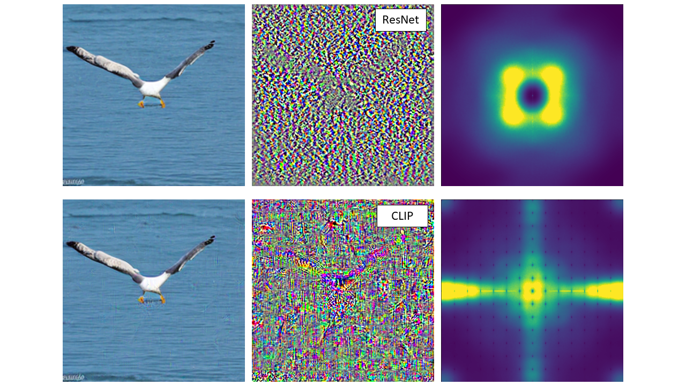

# Exploring the Adversarial Robustness of CLIP

[](https://grip-unina.github.io/ZED/)
[](https://arxiv.org/abs/2407.19553)
[](https://www.grip.unina.it)

This is the official repository of the paper:
[Exploring the Adversarial Robustness of CLIP for AI-generated Image Detection](https://arxiv.org/abs/2407.19553).

Vincenzo De Rosa, Fabrizio Guillaro, Giovanni Poggi, Davide Cozzolino, and Luisa Verdoliva.

## Overview
In recent years, many forensic detectors have been proposed to detect AI-generated images and prevent their use for malicious purposes. Convolutional neural networks (CNNs) have long been the dominant architecture in this field and have been the subject of intense study. However, recently proposed Transformer-based detectors have been shown to match or even outperform CNN-based detectors, especially in terms of generalization. In this paper, we study the adversarial robustness of AI-generated image detectors, focusing on Contrastive Language-Image Pretraining (CLIP)-based methods that rely on Visual Transformer (ViT) backbones and comparing their performance with CNN-based methods. We study the robustness to different adversarial attacks under a variety of conditions and analyze both numerical results and frequency-domain patterns. CLIP-based detectors are found to be vulnerable to white-box attacks just like CNN-based detectors. However, attacks do not easily transfer between CNN-based and CLIP-based methods. This is also confirmed by the different distribution of the adversarial noise patterns in the frequency domain. Overall, this analysis provides new insights into the properties of forensic detectors that can help to develop more effective strategies.
<center>  </center>

## Dataset
The dataset can be downloaded [here](https://www.grip.unina.it/download/prog/AdversarialRobustnessCLIP/AdversarialRobustnessCLIP.zip) or using the following script:

```
bash ./scripts/get_dataset.sh OUTPUT_DIR_PATH
```

## Detectors' weights
The weights can be downloaded [here](https://www.grip.unina.it/download/prog/AdversarialRobustnessCLIP/weights_AdversarialRobustnessCLIP.zip) or using the following script:

```
bash ./scripts/get_weights.sh OUTPUT_DIR_PATH
```

## Setup
To install the required environment, use Conda:

```
conda env create -f environment.yml
```

## Attacks

### Configure attacks
You can configure the attacks using YAML files located in the configs directory. These files allow you to customize attack parameters. Below is an example configuration:

```
attack_real: True
real_label: 0
attack_fake: True
fake_label: 1

networks:
  - name: WANG_latent_r50
  ...

attacks:
  - name: DIFGSM
    args:
      steps: 10
      eps: 8
      alpha: 2
  ...
```

### Run attacks
To execute attacks, you can either use the provided [run_attack.sh](./scripts/run_attack.sh) script or run the attack manually:

```
python run_attack.py --config ./configs/latent.yaml \
    --img_csv ./AdversarialRobustnessCLIP/latent/list_images_latent.csv \
    --dataset_dir ./AdversarialRobustnessCLIP/ \
    --out_dir ./images/latent
```

## Metrics
To evaluate the performance of the attacks, calculate metrics using:

```
python metrics.py --config ./configs/latent.yaml \
    --img_csv ./AdversarialRobustnessCLIP/latent/list_images_latent.csv \
    --dataset_dir ./AdversarialRobustnessCLIP/ \
    --adv_dir ./images/latent \
    --res_dir ./res_csv/latent
```

## FFT
For frequency domain analysis, save average power spectra using:

```
python residue_fft.py --config ./configs/latent.yaml \
    --img_csv ./AdversarialRobustnessCLIP/latent/list_images_latent.csv \
    --adv_dir ./images/latent \
    --out_dir ./fft_images/latent
```

## License

Copyright 2024 Image Processing Research Group of University Federico
II of Naples ('GRIP-UNINA'). All rights reserved.
                        
Licensed under the Apache License, Version 2.0 (the "License");       
you may not use this file except in compliance with the License. 
You may obtain a copy of the License at                    
                                           
    http://www.apache.org/licenses/LICENSE-2.0
                                                      
Unless required by applicable law or agreed to in writing, software
distributed under the License is distributed on an "AS IS" BASIS,    
WITHOUT WARRANTIES OR CONDITIONS OF ANY KIND, either express or implied.                         
See the License for the specific language governing permissions and
limitations under the License.

## Bibtex 

```
@article{de2024exploring,
  title={Exploring the Adversarial Robustness of CLIP for AI-generated Image Detection},
  author={De Rosa, Vincenzo and Guillaro, Fabrizio and Poggi, Giovanni and Cozzolino, Davide and Verdoliva, Luisa},
  journal={arXiv preprint arXiv:2407.19553},
  year={2024}
}
```

## Acknowledgments
We gratefully acknowledge the support of this research by a TUM-IAS Hans Fischer Senior Fellowship and a Google Gift. In addition, this work has received funding by the European Union under the Horizon Europe vera.ai project, Grant Agreement number 101070093, and was partially supported by SERICS (PE00000014) under the MUR National Recovery and Resilience Plan, funded by the European Union - NextGenerationEU. Finally, we thank the partnership and collaboration with the São Paulo Research Foundation (Fapesp) Horus project, Grant #2023/12865-8.
